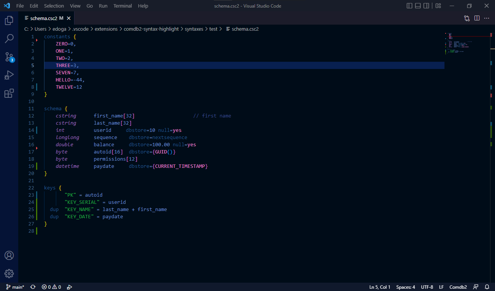

# Comdb2 Syntax Highlight

VSCode syntax highlight support for comdb2.

## Overview

Comdb2 is an open-source, clustered RDBMS developed by Bloomberg LP. More documentation
about comdb2 can be found .

This project provides syntax highlight for the previously colorless comdb2 schema
file to match the colorful Bloomberg keyboard.

## Known Issues

- Regex rules of float, decimal, and maybe datetime values are not 100% correct.

- Missing syntax rules for nested SQL expression in Keys and Constraints section.

## Release Notes

### 1.0.0

Initial release of comdb2-syntax-highlight: Provide simple syntax highlight for
keywords, constants, different sections in comdb2
